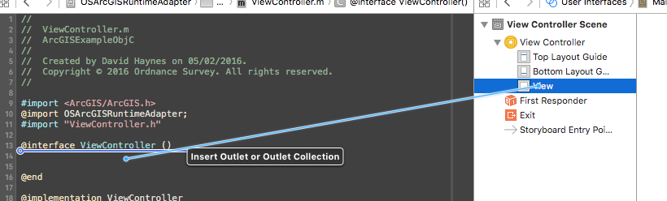
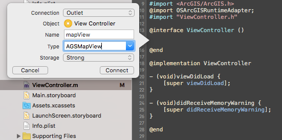
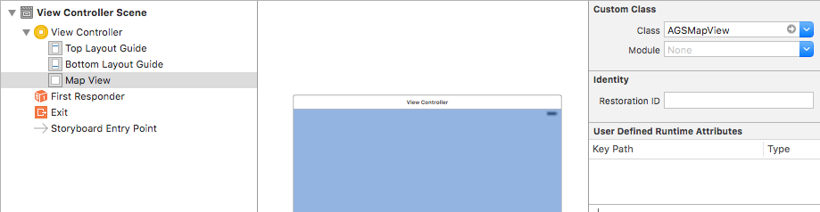

# ArcGIS Runtime Adapter for OS Maps API

This is a small framework that enables rapid integration of the ESRI ArcGIS Runtime iOS SDK with the OS Maps API.

### Before You Begin

1. Register for an ArcGIS developer account: [https://developers.arcgis.com/sign-up/](https://developers.arcgis.com/sign-up/)

2. Once you have an account, install the ArcGIS Runtime SDK on your development machine. The download can be found here: [https://developers.arcgis.com/ios/](https://developers.arcgis.com/ios/)

3. Obtain your OS Maps API key from Ordnance Survey. Follow the 'Getting Started' guide at: [https://developer.ordnancesurvey.co.uk](https://developer.ordnancesurvey.co.uk) to do this.

### Xcode Project Setup

The officially supported way to use the OSArcGISRuntimeAdapter framework, is with [Carthage](https://github.com/Carthage/Carthage) but you can also use Cocoapods or build the OSArcGISRuntimeAdapter framework manually.

##### If using Carthage:

1. Add `github "OrdnanceSurvey/os-arcgis-runtime-adapter"` to your Cartfile.
2. Run `carthage update --platform iOS --no-use-binaries`
3. Drag the built framework from the `Carthage/Build` folder into the "Linked Frameworks and Libraries" section in the "General" settings tab of your application target.
4. In the "Build Phases" of your application target's settings, click the '+' and select "New Run Script Phase". Add the following to the script:

    `/usr/local/bin/carthage copy-frameworks`

    and add the path to the OS framework in the "Input Files" section:

    `$(SRCROOT)/Carthage/Build/iOS/OSArcGISRuntimeAdapter.framework`

You can now move on to [Creating a Map](#creating-a-map)

##### Manual framework build:

1. Clone the repo
2. Build the framework
3. Drag the framework into the "Linked Frameworks and Libraries" section in the "General" settings tab of your application target.
4. Add the embed frameworks step to your build phases.

### Creating a Map

In your view controller, import the ArcGIS and OS frameworks:

Objective-C

```
#import <ArcGIS/ArcGIS.h>
@import OSArcGISRuntimeAdapter;
```

Swift

```
import ArcGIS;
import OSArcGISRuntimeAdapter;
```

Create a property for your map view by e.g. dragging from a view in Interface Builder into your view controller class:



Name it `mapView` and the type `AGSMapView`:



Set the class of the view in Interface Builder to `AGSMapView`:



Now, in your view controller's `viewDidLoad` method, create a layer and add it to the map, like so (Note: You will need to add your own api key where specified.):

Objective-C

```
    OSWMTSBaseLayer *layer = [[OSWMTSBaseLayer alloc] initWithBasemapStyle:OSBaseMapStyleRoad
                                                          spatialReference:OSSpatialReferenceBNG
                                                                    apiKey:<api key>];
    [self.mapView addMapLayer:layer];

```

Swift

```
        let layer = OSWMTSBaseLayer(basemapStyle: .Road, spatialReference: .BNG, apiKey: <api key>)
        self.mapView.addMapLayer(layer)
```


If everything is setup correctly, when you run your app, the map will load and you will see an OS basemap:


### Examples

The project contains both Objective-C and Swift example applications which illustrate usage of the OS Maps API. To run these, make sure your API key is in a file named `APIKEY` in the project root directory.

`$ printf <your-api-key> > APIKEY`

## License
Ordnance Survey's code is licensed under the terms of the [Apache 2.0 License](LICENSE).

You must also adhere to the terms and conditions set out by Esri for use of the ArcGIS SDK.
