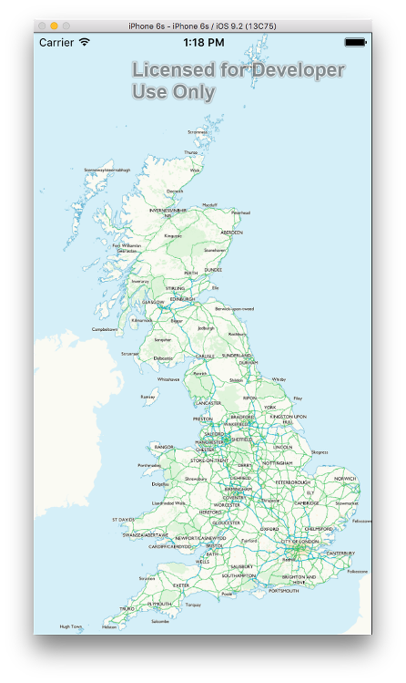

# ArcGIS Runtime Adapter for OS Maps API

This is a small framework that enables rapid integration of the ESRI ArcGIS Runtime iOS SDK with the OS Maps API.

### Before You Begin

1. Register for an ArcGIS developer account: [https://developers.arcgis.com/sign-up/](https://developers.arcgis.com/sign-up/)

2. Once you have an account, install the ArcGIS Runtime SDK on your development machine. The download can be found here: [https://developers.arcgis.com/ios/](https://developers.arcgis.com/ios/)

3. Obtain your OS Maps API key from Ordnance Survey. Following the 'Getting Started' guide on [https://developer.ordnancesurvey.co.uk](https://developer.ordnancesurvey.co.uk) to do this.

### Xcode Project Setup

Once you have created a project in Xcode, configure the ESRI framework like so:

1. Project -> Build Settings -> Framework Search Paths:
`$(HOME)/Library/SDKs/ArcGIS/iOS/`

2. Target -> Build Settings -> Other linker flags:
`-ObjC -framework ArcGIS -l c++`

##### If using Carthage

The easiest way to integrate the project is to use [Carthage]()

1. Add `github "OrdnanceSurvey/os-arcgis-runtime-adapter"` to your Cartfile.
2. Run `carthage update`
3. Drag the built framework from the `Carthage/Build` folder into the "Linked Frameworks and Libraries" section in the "General" settings tab of your application target.
4. In the "Build Phases" of your application target's settings, click the '+' and select "New Run Script Phase". Add the following to the script:

    `/usr/local/bin/carthage copy-frameworks`

    and add the path to the OS framework in the "Input Files" section:
    
    `$(SRCROOT)/Carthage/Build/iOS/OSArcGISRuntimeAdapter.framework`

You can now move on to 'Creating a Map'
    
##### Manual setup

1. Clone the repo
2. Build the framework
3. Drag the framework into the "Linked Frameworks and Libraries" section in the "General" settings tab of your application target.
4. Add the embed frameworks step to your build phases.

### Creating a Map

### Examples

The project contains both Objective-C and Swift example applications which illustrate usage of the OS Maps API. To run these, make sure your API key is in a file named `APIKEY` in the project root directory.

`$ printf <your-api-key> > APIKEY`